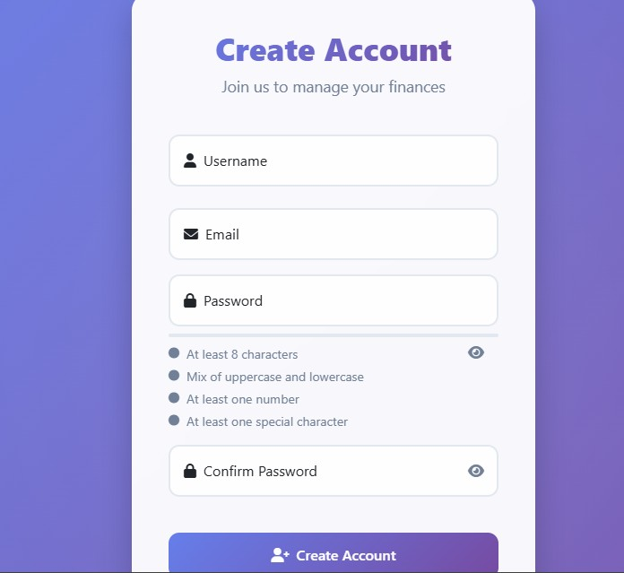
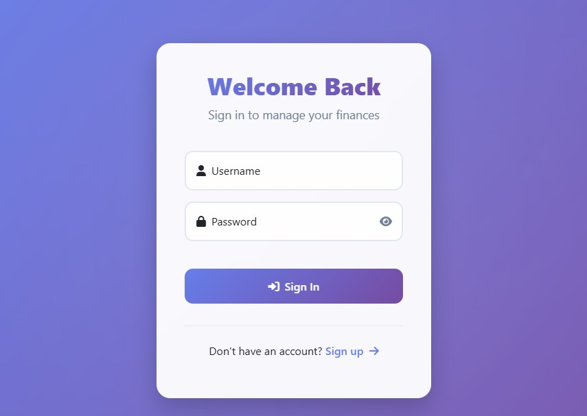
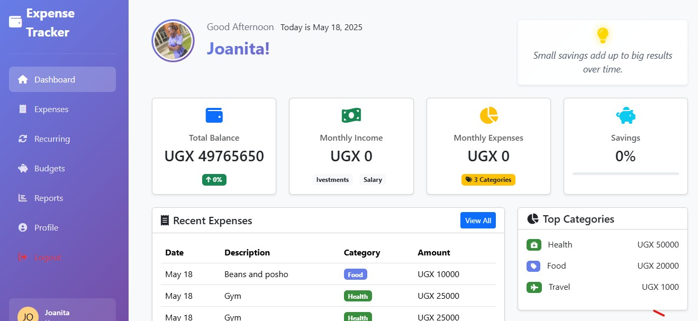
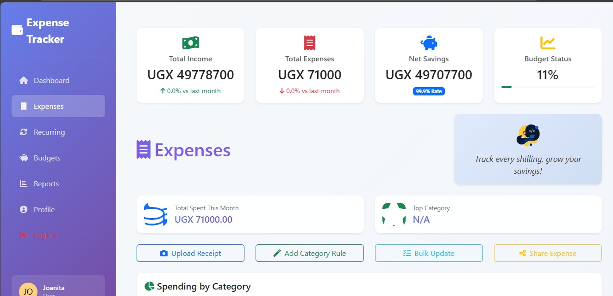
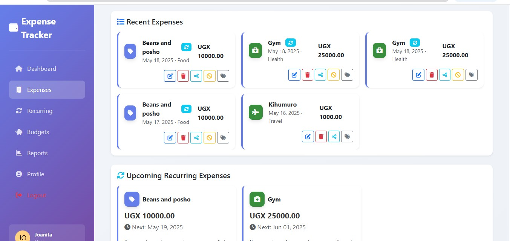
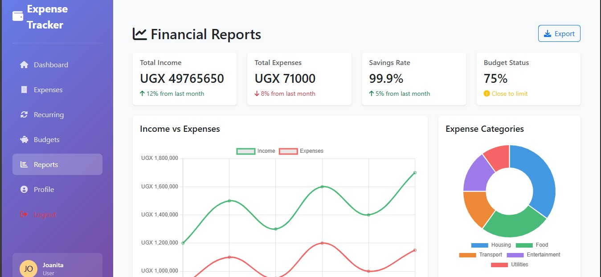
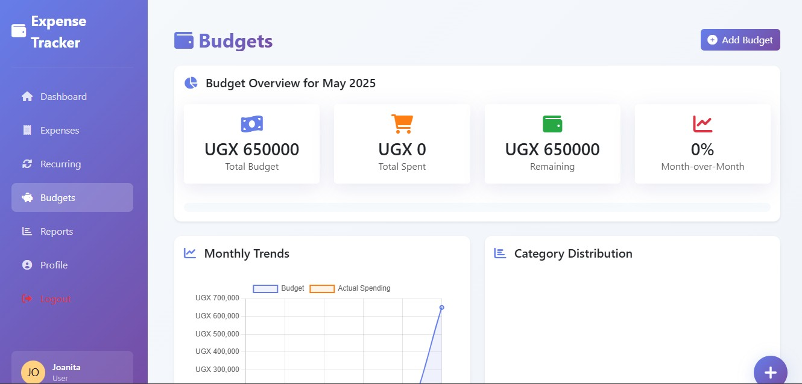
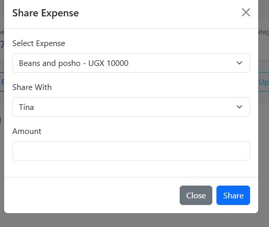

#### 📊 Expense Tracker – Personal Finance Manager

<span style="font-size:14px;">
Expense Tracker is a robust and feature-rich financial management application developed with Django, tailored to meet the diverse needs of individuals, families, and businesses aiming to gain full control over their finances. It enables users to effortlessly record and categorize expenses, set and monitor personalized budgets, and visualize spending patterns through interactive analytics and reports. The platform supports multi-user collaboration, allowing for shared financial oversight within households or teams, and incorporates automated notifications for budget limits and upcoming bills to promote proactive money management. With a secure authentication system and user-friendly interface, Expense Tracker simplifies the complexities of daily financial tracking and decision-making, empowering users to build better financial habits, avoid overspending, and confidently achieve their short- and long-term financial goals.
</span>
---

## 📑 Table of Contents

- [Key Features](#-key-features)
- [Screenshots](#-screenshots)
- [Technologies Used](#-technologies-used)
- [Development Setup](#️-development-setup)
- [Project Folder Structure](#project-folder-structure)
- [API Endpoints](#-api-endpoints)
- [Deployment Guide](#-deployment-guide)
- [How to Contribute](#-how-to-contribute)
- [Support](#-support)
- [Acknowledgments](#-acknowledgments)
- [About Me](#-about-me)
- [Code Organization](#-code-organization)
- [Roadmap](#roadmap)

---
## 🚀 Key Features

### 📌 Expense Management

- **Detailed Expense Logging** – Track expenses with descriptions, amounts, and timestamps.
- **Multi-Currency Support** – Record transactions in different currencies for international users.
- **Smart Categorization** – Organize expenses using icons, tags, and color-coded categories.
- **Receipt Upload & Processing** – Attach receipts for automatic expense verification.
- **Expense Notes & Attachments** – Keep extra details for reference and documentation.

### 🔄 Recurring Expense Automation

- **Flexible Scheduling** – Set up daily, weekly, monthly, or custom recurring transactions.
- **Automatic Expense Generation** – Pre-configured expenses appear automatically based on user settings.
- **Customizable End Dates** – Define expiration dates for recurring payments.
- **Status Tracking** – Monitor active, paused, or completed recurring expenses.

### 👨‍👩‍👧‍👦 Family Expense Sharing

- **Shared Financial Tracking** – Collaborate on expenses with family members or roommates.
- **Bill Splitting** – Easily divide costs among multiple users.
- **Real-Time Notifications** – Get alerts when a shared expense is logged or updated.
- **Transaction History** – Maintain a complete record of shared financial activities.

### 💰 Budget Management

- **Custom Budget Planning** – Allocate budgets for various expense categories.
- **Rolling Budgeting Options** – Configure budgets to adjust dynamically based on spending patterns.
- **Real-Time Budget Utilization** – Track spending progress compared to allocated budgets.
- **Automated Budget Overrun Alerts** – Receive notifications when nearing budget limits.

## 🌟 Screenshots

Below are some screenshots to give you a quick look at how Expense Tracker works:

### Visual View
*The login page provides a secure and user-friendly authentication process, ensuring safe access to personal finance management tools.*


*The signup page allows new users to create a secure account, personalize their financial settings, and start managing their expenses effortlessly.*


 
*The main dashboard provides an overview of your spending and income, as well as visual financial reports.*



### Adding Expenses
*Easily add new expenses with categories, descriptions, and receipt attachments.*



### Expense Categories
*Organize and track expenses with customizable categories and tags.*




### Analytics Dashboard
*Detailed financial analytics and visualizations to track your spending patterns.*



### Budget Management

*Set and monitor budgets for different expense categories.*



### Shared Expenses
*Collaborate and split expenses with family members or roommates.*


---

## **🛠️ Development Setup**  

### **1️⃣ Clone & Setup Environment**  
```bash
git clone https://github.com/yourusername/expense-tracker.git
cd expense-tracker
python -m venv venv
source venv/bin/activate  # On Windows: venv\Scripts\activate
```  

### **2️⃣ Install Dependencies**  
```bash
pip install -r requirements.txt
```  

### **3️⃣ Configure Environment Variables**  
Create a `.env` file with:  
```
DEBUG=True
SECRET_KEY=your_secret_key
DATABASE_URL=sqlite:///db.sqlite3
```  

### **4️⃣ Database Setup**  
```bash
python manage.py makemigrations
python manage.py migrate
python manage.py createsuperuser
```  

### **5️⃣ Run Development Server**  
```bash
python manage.py runserver
```  
## Project Folder Structure

```plaintext
.vscode
budgets
    ├── migrations
    │   └── __pycache__
    └── __pycache__
expenses
    ├── migrations
    │   └── __pycache__
    ├── templatetags
    │   └── __pycache__
    └── __pycache__
finance_manager
    └── __pycache__
media
    ├── profile_pics
    └── receipts
reports
    ├── migrations
    │   └── __pycache__
    └── __pycache__
static
    ├── assets
    │   └── screenshots
    ├── css
    └── js
templates
    ├── budgets
    ├── expenses
    ├── partials
    ├── reports
    └── users
        └── modals
users
    ├── management
    │   └── commands
    ├── migrations
    │   └── __pycache__
    ├── templatetags
    │   └── __pycache__
    └── __pycache__


```

## **📝 API Endpoints**  
| **Endpoint** | **Functionality** |  
|-------------|------------------|  
| `/api/expenses/` | Manage and retrieve user expenses |  
| `/api/budgets/` | Budget creation, tracking, and allocation |  
| `/api/reports/` | Generate analytics and financial insights |  
| `/api/users/` | User authentication, profiles, and permissions |  

## **🚀 Deployment Guide**
### **Requirements**
- Python 3.8+ 
- Django 4.x  
- Dependencies listed in `requirements.txt`  

### **Production Configuration**  
1. Set `DEBUG=False` for security.  
2. Configure **PostgreSQL** or another production-ready database.  
3. Enable **SSL** for secure data encryption.  
4. Set up **static file hosting** using Django’s built-in settings.  

---

### 🚀 How to Contribute

#### **1️⃣ Fork & Clone the Repository**  
First, fork the repository to your own GitHub account using the "Fork" button on GitHub.

Then, clone your forked repository to your local machine:
```bash
git clone https://github.com/NAMATOVU-CHRISTINE/ExpenseTrack.git
cd ExpenseTrack
#### **2️⃣ Create a Feature Branch**  
Create a new branch for your feature:
```bash
git checkout -b feature/<your-feature-name>
```

#### **3️⃣ Commit & Push Changes**  
After making your changes, stage, commit, and push them:
```bash
git add .
git commit -m "Add <your-feature-name>: <short description of your changes>"
git push origin feature/<your-feature-name>
```

> - Replace `<your-feature-name>` with a concise, descriptive branch name.
> - Update the commit message with a brief summary of your changes.
> - After pushing, open a Pull Request from your branch to `NAMATOVU-CHRISTINE/ExpenseTrack` on GitHub!

## 📚 Support 

If you need help or have any questions, please reach out:📧 **Email:** expensetracker100@gmail.com  

---

## **🙏 Acknowledgments**  
I extend my gratitude to:  
- **Django community** – For building an amazing framework.  
- **Bootstrap team** – For responsive UI components.  
- **Chart.js contributors** – For interactive financial visualizations.  
- **Font Awesome developers** – For beautiful icons.  
- **Every contributor and user** improving this project!  

---

## **🚀 About Me**  

**💻 I’m a Computer Scientist and aspiring Full Stack Developer, passionate about building high-quality, impactful software solutions. With a strong foundation in both front-end and back-end technologies, I am dedicated to continuous learning and driven by the desire to create software that makes a real difference. 🚀**

## 🚀 Code Organization

### CSS Structure
- **core.css**: Contains base styles, variables, and common component styles
- **layout.css**: Styles for layout and navigation elements
- **dashboard.css**: Dashboard-specific styles and components
- **animations.css**: Animation keyframes and utility classes
- **forms.css**: Form styling and input customization

### JavaScript Modules
- **charts.js**: Chart initialization and configuration
- **utils.js**: Utility functions for numbers, dates, and animations
- **finance-features.js**: Finance-related feature implementations
- **layout.js**: Layout management and theme switching
- **dashboard.js**: Main dashboard initialization

### Project Structure

```
expense_tracker/
├── static/
│   ├── css/               # Organized CSS files
│   ├── js/
│   │   ├── modules/      # Modular JavaScript components
│   │   └── dashboard.js  # Main dashboard initialization
│   └── assets/          # Images and other static assets
├── templates/
│   ├── base.html        # Base template
│   ├── partials/        # Reusable template components
│   └── app-specific/    # App-specific templates
└── apps/
    ├── expenses/        # Expense management
    ├── budgets/         # Budget management
    ├── reports/         # Reports and analytics
    └── users/           # User management
```

### Dependencies
- Django 4.2+
- Bootstrap 5
- Chart.js
- Font Awesome
- Animate.css

### Browser Support
- Chrome (latest)
- Firefox (latest)
- Safari (latest)
- Edge (latest)

## 🛠️ Setup Instructions

1. Create and activate a virtual environment:
```bash
python -m venv venv
.\venv\Scripts\activate  # Windows
source venv/bin/activate  # Linux/Mac
```

2. Install dependencies:
```bash
pip install -r requirements.txt
```

3. Apply database migrations:
```bash
python manage.py migrate
```

4. Create a superuser:
```bash
python manage.py createsuperuser
```

5. Run the development server:
```bash
python manage.py runserver
```

